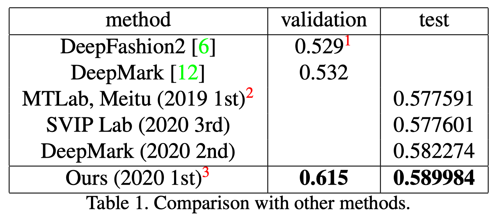

# Aggregation and Finetuning for Clothes Landmark Detection

__[WIP] Code release is still in preparation, stay tuned.__


__1st place solution__ for [__CVPR 2020 DeepFashion2 Clothes Landmark Detection Track__](https://competitions.codalab.org/competitions/22966). This repo contains code for the keypoints detector. The object detection part is not contained.




## Prerequisite

### Install

* install HRNet dependencies as in [HRNet/HRNet-Human-Pose-Estimation](https://github.com/HRNet/HRNet-Human-Pose-Estimation), then

    ```
    cd HRNet-Human-Pose-Estimation/lib
    make
    ```

* install cocoapi in [switchablenorms/DeepFashion2](https://github.com/switchablenorms/DeepFashion2)

    ```bash
    git clone https://github.com/switchablenorms/DeepFashion2
    cd DeepFashion2/deepfashion2_api/PythonAPI/
    make install
    ```

    

### Data preprocess

* download data to `HRNet-Human-Pose-Estimation/lib/data/deepfashion2/`

* preprocess data to following structure

    ```bash
    data/deepfashion2/
    	annotations/ # original data, converted from deepfashion2_to_coco.py
    		train_coco.json
    		validation_coco.json
    		test_coco.json
    	annotations_agg81kps/ # for training in aggregation
    		train_coco_agg81kps.json
    	annotations_per_category/ # for validation in finetuning
    		validation_coco_category_1.json
    		...
    		validation_coco_category_13.json
    	annotations_per_category_agg81kps/ # for training in finetuning
    		train_coco_category_1.json
    		...
    		train_coco_category_13.json
    	images/ # images, make some symlinks (or just cp) for this to be done
    		train/
    		validation/
    		test/
    ```

* COCO pretrained weights is downloaded from [here](https://github.com/HRNet/HRNet-Human-Pose-Estimation) to `HRNet-Human-Pose-Estimation/models/pytorch/pose_coco/pose_hrnet_w48_384x288.pth`


## Usage

### Training

* Aggregation

    ```bash
    python tools/train.py --cfg experiments/deepfashion2/w48_512x384_adam_lr1e-3-agg81kps.yaml
    ```

* Finetune

    ```bash
    # finetuning 1st category
    python tools/train.py --cfg experiments/deepfashion2/w48_512x384_adam_lr1e-3-agg81kps-category1-hflip.yaml
    # finetuning 2nd category
    python tools/train.py --cfg experiments/deepfashion2/w48_512x384_adam_lr1e-3-agg81kps-category2-hflip.yaml
    # finetuning others ...
    ```


​    

### Testing

* Testing on validation set (with gt det)

    ```bash
    CUDA_VISIBLE_DEVICES=0,1,2,3 python tools/test.py \
        --cfg experiments/deepfashion2/w48_512x384_adam_lr1e-3-agg81kps-category1-hflip.yaml \
    GPUS '(0,1,2,3)' \
        TEST.MODEL_FILE output/deepfashion2agg81kps/pose_hrnet/w48_512x384_adam_lr1e-3-agg81kps-category1-hflip/final_state.pth \
        TEST.USE_GT_BBOX True \
        TEST.IMAGE_THRE 0.01 \
        DATASET.TEST_SET validation \
        TEST.FLIP_TEST True
    ```
    
* Testing  on validation set (with object det results `/path/to/det.json`)

    ```bash
    CUDA_VISIBLE_DEVICES=0,1,2,3 python tools/test.py \
        --cfg experiments/deepfashion2/w48_512x384_adam_lr1e-3-agg81kps-category1-hflip.yaml \
    GPUS '(0,1,2,3)' \
        TEST.MODEL_FILE output/deepfashion2agg81kps/pose_hrnet/w48_512x384_adam_lr1e-3-agg81kps-category1-hflip/final_state.pth \
        TEST.USE_GT_BBOX False \
        TEST.COCO_BBOX_FILE '/path/to/det.json' \
        TEST.IMAGE_THRE 0.01 \
        DATASET.TEST_SET validation \
        TEST.FLIP_TEST True
    
    ...
    ```


## Reference

[HRNet/HRNet-Human-Pose-Estimation](https://github.com/HRNet/HRNet-Human-Pose-Estimation)

Please cite following if you use the code

```tex
@misc{lin2020aggregation,
    title={Aggregation and Finetuning for Clothes Landmark Detection},
    author={Tzu-Heng Lin},
    year={2020},
    eprint={2005.00419},
    archivePrefix={arXiv},
    primaryClass={cs.CV}
}
```


## License

MIT